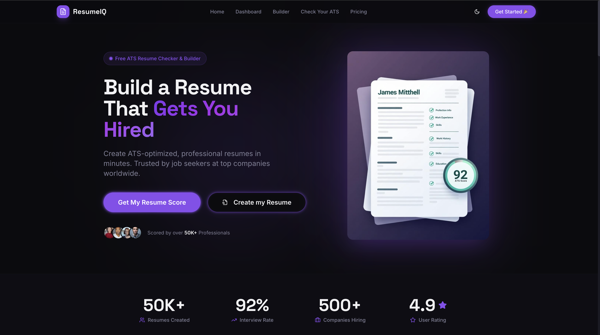
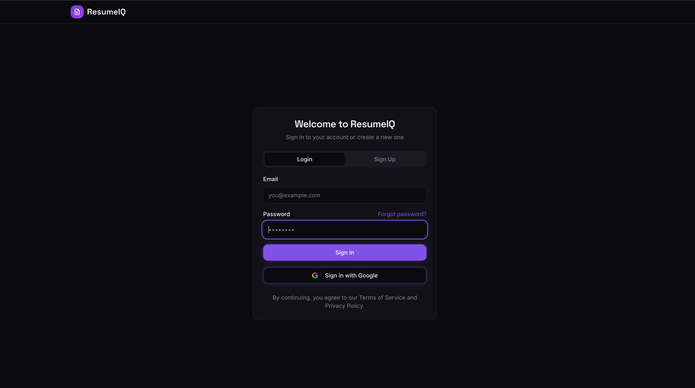
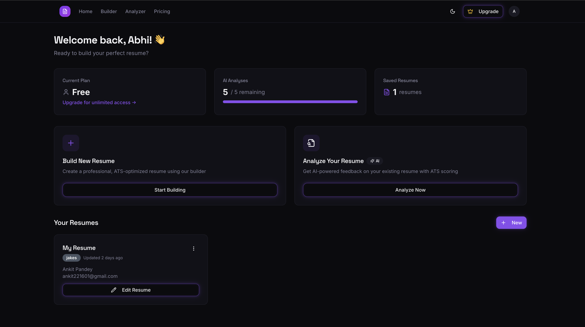
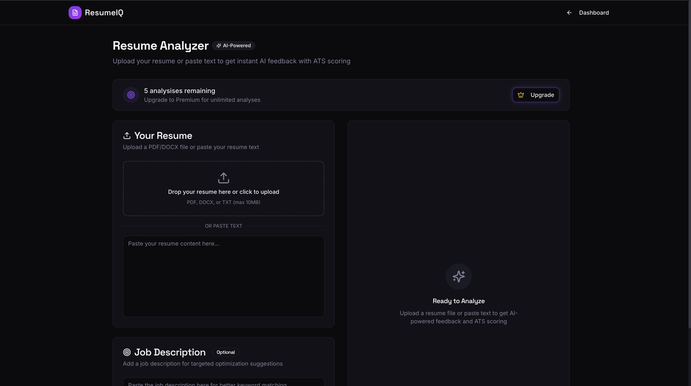
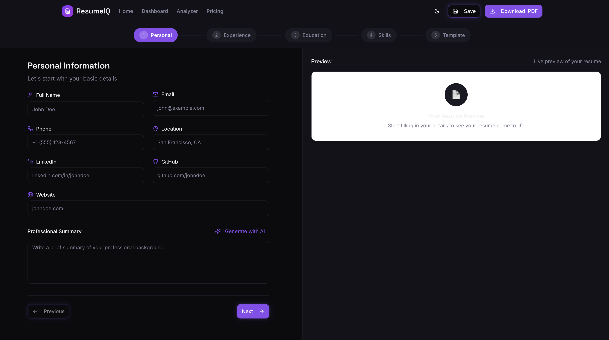
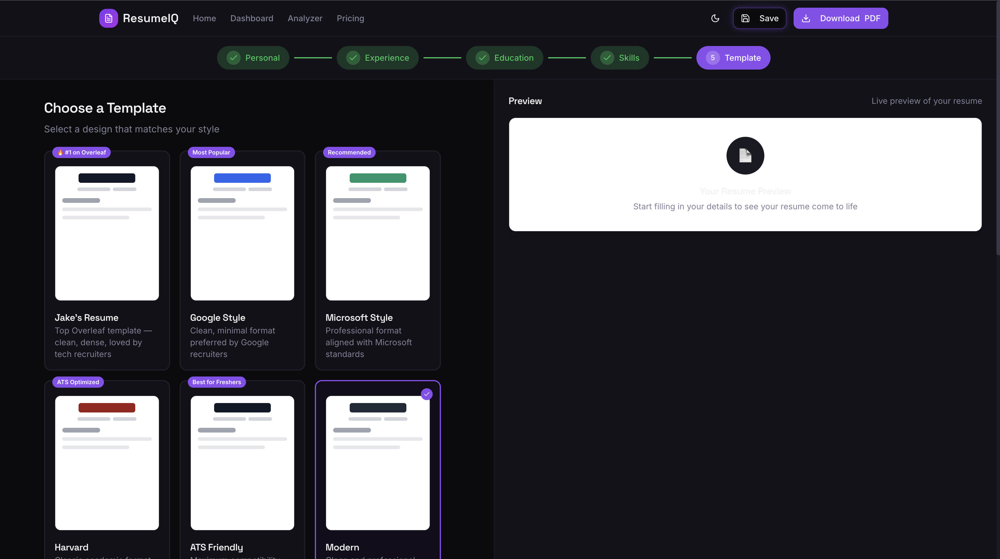
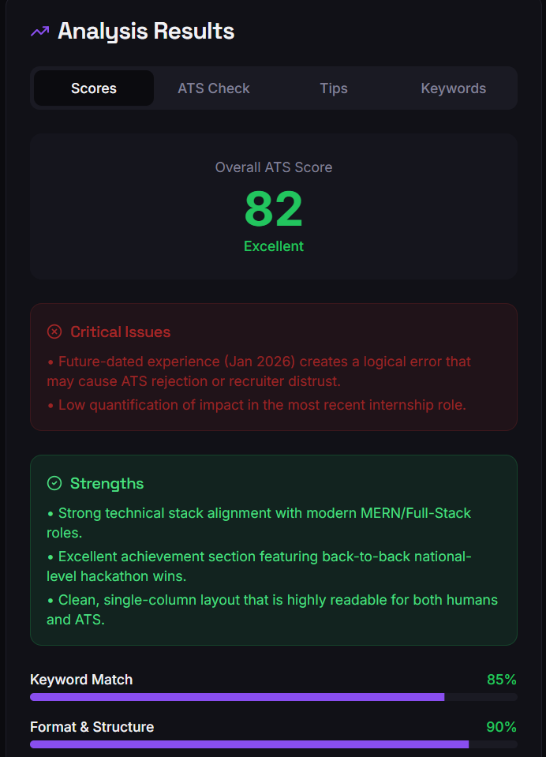
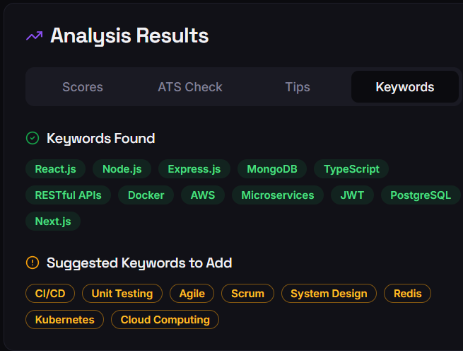

# ResumeIQ 🚀  
### AI-Powered ATS Resume Builder & Analyzer

ResumeIQ is a modern, AI-powered web application that helps job seekers create **professional, ATS-friendly resumes** in minutes. It analyzes resumes using intelligent logic, provides actionable feedback, and helps improve the chances of getting shortlisted by Applicant Tracking Systems (ATS).

---

## 🌐 Live Demo

- **Live Website:**  
- **Custom Domain:** 
- **Local Development URL:** http://localhost:8080  

---

## 📸 App Screenshots

### 📊 Dashboard


### 🏠 Sign In / Home Page


### 📈 Analyzer


### 🔍 Resume Analyzer


### 🛠️ Builder


### 📝 Template


### 🔍 ATS Check


### 📈 ATS Results


---

## ✨ Features

### 🚀 AI-Powered Resume Analysis
- Intelligent analysis of resume content
- ATS compatibility checks
- Keyword and formatting suggestions

### 📝 Multiple Professional Templates
- 10+ modern, ATS-optimized resume templates
- Clean layouts suitable for recruiters
- Easy customization

### 🎯 ATS Optimization
- Designed to pass Applicant Tracking Systems
- Avoids common ATS parsing issues
- Optimized structure and formatting

### 📊 Resume Scoring
- Instant resume score
- Section-wise feedback
- Clear improvement recommendations

### 🔍 Resume Parser
- Upload an existing resume
- Automatically extract and analyze content
- Convert old resumes into editable versions

### 💾 Cloud Storage
- Secure authentication using Supabase
- Save and manage resumes in the cloud
- Access resumes from anywhere

---

## 🛠️ Tech Stack

### Frontend
- **React 18** with TypeScript
- **Vite** (build tool)
- **Tailwind CSS** + shadcn/ui
- **React Router DOM**
- **React Hook Form** + Zod
- **Framer Motion** (animations)
- **Recharts** (charts)
- **react-to-print** (PDF export)
- **@dnd-kit** (drag & drop)

### Backend
- **PostgreSQL** (database)
- **Supabase Edge Functions** (Deno runtime)
- **Row Level Security** (RLS)
- **File Storage** (Supabase Storage)

### AI
- **Google Gemini 2.5 Flash** (resume parsing)
- **Google Gemini 3 Flash Preview** (content generation & ATS analysis)

### Authentication
- **Email/Password** (Supabase Auth)
- **Google OAuth 2.0**
- **Password Reset** functionality

### Deployment
- **Vercel** (hosting)
- **Domain:** resumescraftai.tech (.tech TLD)

---

## 📁 Project Structure

```
ResumeIQ/
├── src/
│   ├── components/
│   │   ├── ui/           # shadcn/ui components
│   │   ├── resume/       # Resume-related components
│   │   └── landing/      # Landing page sections
│   ├── pages/
│   │   ├── Index.tsx     # Landing page
│   │   ├── Auth.tsx      # Authentication
│   │   ├── Dashboard.tsx # Main dashboard
│   │   ├── Builder.tsx   # Resume builder
│   │   ├── Analyzer.tsx  # Resume analyzer
│   │   ├── Pricing.tsx   # Pricing page
│   │   ├── PrivacyPolicy.tsx
│   │   └── TermsOfService.tsx
│   ├── contexts/
│   │   └── AuthContext.tsx
│   ├── hooks/
│   ├── services/
│   ├── utils/
│   └── App.tsx
├── supabase/
│   └── functions/
│       └── generate-content/  # AI generation edge function
        └── analyze-resume/
        └── parse-resume/
├── public/
│   ├── favicon.svg
│   ├── robots.txt
│   └── google-site-verification.html
├── screenshots/
│   ├── signin-home.png
│   ├── dashboard.png
│   ├── resume-analyzer.png
│   ├── analyzer.png
│   ├── builder.png
│   ├── template.png
│   ├── ats-check.png
│   └── ats-results.png
├── package.json
├── tailwind.config.js
├── tsconfig.json
└── README.md
```

---

## ⚙️ Getting Started (Local Setup)

### Prerequisites
Ensure you have:
- Node.js (v18 or above)
- npm or yarn

> Recommended installation via nvm  
> https://github.com/nvm-sh/nvm

---

## ⚙️ Setup Instructions

### 1. Clone the repo

```bash
git clone <your-repo-url>
cd ResumeIQ
```

---

### 2. Install dependencies

```bash
npm install
```

---

### 3. Setup Environment Variables

Create `.env` file:

```env
VITE_SUPABASE_URL=your_project_url
VITE_SUPABASE_PUBLISHABLE_KEY=your_anon_key
```

---

### 4. Setup Supabase

* Create a project on Supabase
* Add required tables (profiles, resumes, etc.)
* Enable Authentication (Email + Google)

---

### 5. Add Gemini API Key

In Supabase:

```
Project → Edge Functions → Secrets
```

Add:

```
GEMINI_API_KEY=your_api_key
```

---

### 6. Run project

```bash
npm run dev
```

---

## 🚀 Deployment

* Frontend → Vercel
* Backend → Supabase

---

## 🔐 Authentication

* Email/Password login
* Google OAuth

---

## 🔐 Authentication & Security

### Google OAuth 2.0
- **Status:** Submitted for verification
- **Scopes:** email, profile, openid
- **Consent Screen:** ResumeIQ branding
- **Homepage URL:** 
- **Privacy Policy URL:** 
- **Terms of Service URL:** 

### Email Services
- **Password Reset:** SendGrid SMTP

---

## 🤝 Contributing

Contributions are welcome!

1. Fork the repository
2. Create a feature branch
3. Make changes
4. Test thoroughly
5. Submit a pull request

---

## 🚧 Future Enhancements

- AI resume tailoring for specific job descriptions
- Cover letter generator
- Resume download in PDF/DOCX
- Multi-language support
- Recruiter review mode
- Custom domain full integration

---

## 📄 License

This project is licensed under the **MIT License**.  
You are free to use, modify, and distribute it.

---

## 👨‍💻 Author

<center>
**Ankit Pandey**  
Full Stack Developer (MERN)  


### Let's Connect!
- 📧 ankit221601@gmail.com
- 💼 [LinkedIn](https://www.linkedin.com/in/helloankit-pandey-/)
- 🐙 [GitHub](https://github.com/helloankitpandey/)
- 🐦 [Twitter](https://x.com/heloankitpandey/)
</center>

